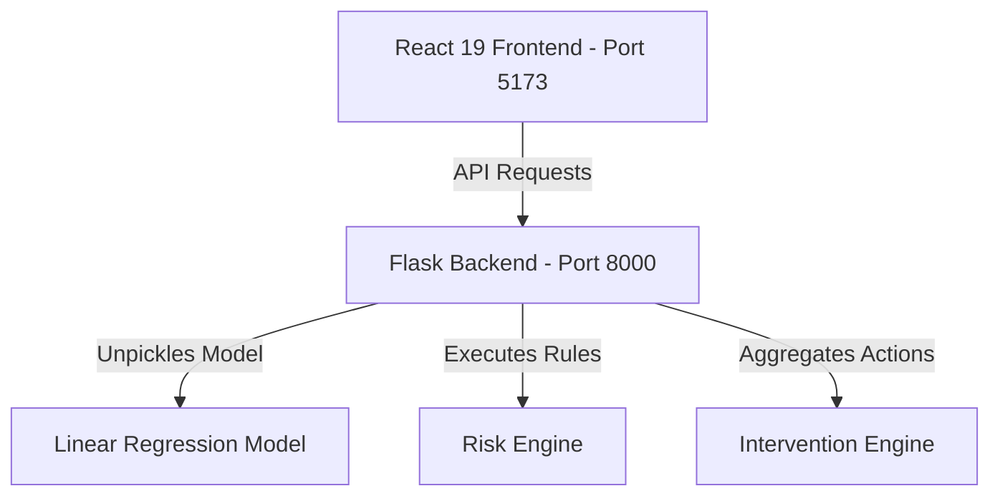

# AquaSentinel Indore — Groundwater Intelligence & Early Warning Portal

**AquaSentinel** is a municipal decision support platform and environmental intelligence tool built for the Indore Municipal Corporation and water resource managers. It integrates a machine learning forecast model, real-time sensor telemetries, and an automated risk engine to evaluate aquifer stress and provide prioritized policy recommendations.

---

## 🏛️ Project Architecture

The application is structured as a unified monorepo containing isolated frontend and backend services:



- **Frontend (`/frontend`)**: A light-themed glassmorphism dashboard built with React 19, Tailwind CSS, Recharts, and Framer Motion.
- **Backend (`/backend`)**: A lightweight Flask API service coordinating model scoring, parameters validation, risk composite scoring, and policy actions.
- **Model (`/model`)**: Pinned scikit-learn Linear Regression model (`aquasentinel_forecast_model.pkl`).
- **Datasets (`/datasets`)**: Core CSV observations used for baseline modeling and station analysis.

---

## 🚀 Unified Setup Instructions

Follow these steps to run the entire system locally.

### 1. Start the Flask Backend API
1. Navigate to the backend directory:
   ```bash
   cd backend
   ```
2. Create and activate a Python virtual environment:
   ```bash
   python -m venv venv
   # On Windows:
   venv\Scripts\activate
   # On macOS/Linux:
   source venv/bin/activate
   ```
3. Install the dependencies:
   ```bash
   pip install -r requirements.txt
   ```
4. Run the application:
   ```bash
   python app.py
   ```
   *The backend API will run on **`http://localhost:8000`**.*

### 2. Start the React Frontend Dashboard
1. Open a new terminal window and navigate to the frontend directory:
   ```bash
   cd frontend
   ```
2. Install npm dependencies:
   ```bash
   npm install
   ```
3. Launch the development server:
   ```bash
   npm run dev
   ```
   *The frontend dashboard will run on **`http://localhost:5173`**.*

---

## 📊 Feature Overview

- **Groundwater Forecast Workspace**: Interactive selection tools mapping target aquifers, seasons, average regional depths, and current levels to calculate projected 30-day aquifer levels.
- **Advanced Preset Tabs**: Interactive segmented selector bars utilizing spring animations to load block profiles (Depalpur, Sanwer, Indore, Mhow).
- **Aquifer Stress Visualizations**: Custom radial stress dials and trend graphs detailing groundwater column drawdowns.
- **Live Sensor Telemetry**: Continuous simulation tracking for local station Water Level, pH, and TDS status.
- **Intervention Playbooks**: Prioritized, color-coded municipal action cards covering Recharge infrastructure, Monitoring routines, and Demand policies.
