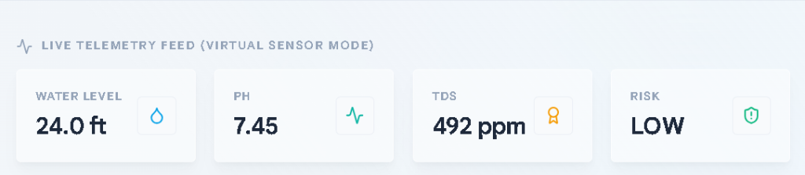
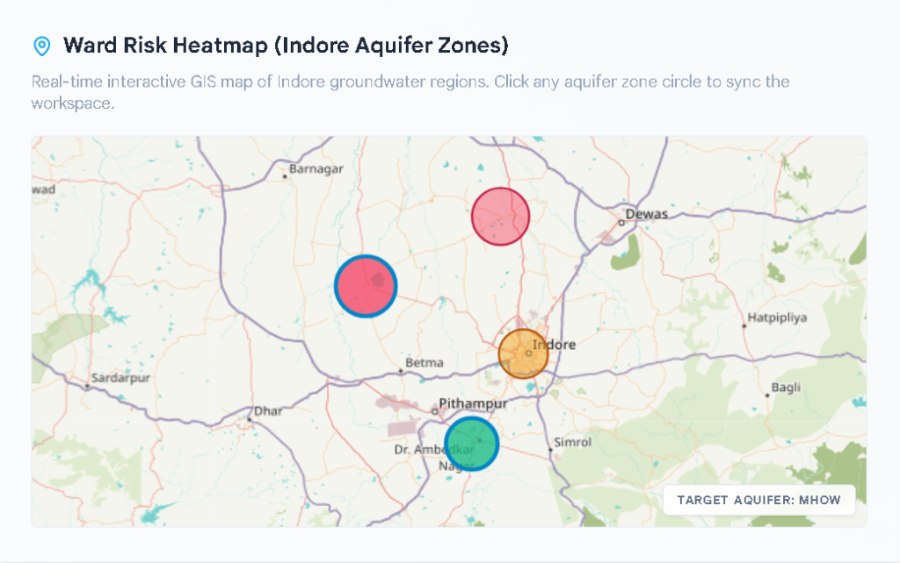
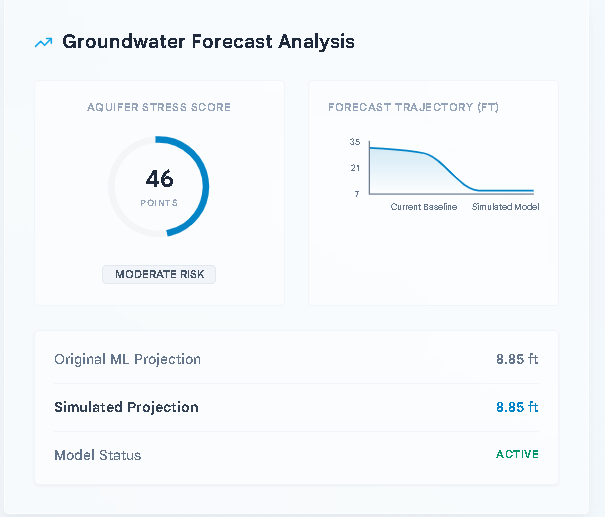
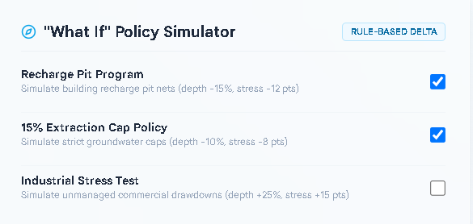

# AquaSentinel Indore - Dashboard Presentation Guide

This guide walks you step-by-step through presenting the AquaSentinel Indore dashboard. It is structured to follow the natural visual flow of the page, explaining what each element represents, how it functions, and how they all connect.

---

## 🎙️ 1. Opening & Hook (The "Why")

> *"Good morning/afternoon everyone. Today, I am excited to present **AquaSentinel Indore**, a groundwater forecasting and decision-support dashboard built using historical groundwater monitoring data from Indore district. As urbanization expands, managing groundwater sustainability is one of our most critical challenges. AquaSentinel brings visibility to our regional aquifer networks, enabling data-driven policies and proactive water resource planning."*

---

## 🖥️ 2. Live Telemetry Feed (Virtual Sensor Mode)
*(Focus on the top-left section of the dashboard)*

*   **What it is**: This section demonstrates how AquaSentinel can integrate future IoT groundwater monitoring feeds. For the MVP, sensor values are simulated for demonstration purposes.
*   **The visual elements**: Four key metric cards: **Water Level**, **pH**, **TDS (Total Dissolved Solids)**, and **Risk**. Below them is a dark, terminal-style **Sensor Control Room Console** scrolling simulated logs.
*   **Script to say**:
    > *"Let’s start with the **Simulated Telemetry Feed**. This section demonstrates how AquaSentinel can integrate future IoT groundwater monitoring feeds. For this MVP, we monitor four groundwater indicators through a simulated telemetry interface: water table level in feet, water pH, TDS in parts-per-million representing water purity, and a calculated safety risk level. Below, you can see the **Sensor Control Room Console** simulating how telemetry packet updates would sync from regional aquifer stations."*

---

## 🗺️ 3. Interactive GIS Map (Block Risk Map)
*(Focus on the map in the lower-left section)*

*   **What it is**: An interactive geographical information system (GIS) mapping out Indore's four main aquifer zones: Depalpur, Sanwer, Indore, and Mhow.
*   **The visual elements**: Saturated color-coded aquifer circles (green for Low risk, amber for Medium risk, rose/red for High risk) overlaying a high-contrast base map with English labels.
*   **Script to say**:
    > *"Moving down, we have the **Groundwater Risk Map**. This is an interactive GIS overlay of Indore's primary aquifer blocks. Each circle represents an aquifer zone. The colors represent their current risk level: green is healthy, amber is moderate stress, and rose-red signals a high-risk zone. The map is fully interactive—clicking on any circle (for example, Mhow or Indore) instantly updates and synchronizes our entire workspace on the right to focus on that specific aquifer’s coordinates and characteristics."*

---

## 📊 4. Groundwater Forecast Analysis & Community Outlook
*(Focus on the right section of the dashboard)*

*   **What it is**: The circular stress score gauge, the human-centric community metrics panel, and the 3-column projection KPI grid.
*   **Script to say**:
    > *"Now let’s look at our **Groundwater Forecast Analysis** on the right. 
    > 
    > The first KPI card is the **Aquifer Stress Score**. The Aquifer Stress Score combines forecasted groundwater levels with block-level and hydrogeological risk indicators to give engineers a single, readable score.
    > 
    > Next to the stress gauge is our **Community Water Security Outlook**. We created this card to translate abstract water measurements into estimated community impact indicators:
    > 1. **Population Dependent**: Estimated population associated with the selected groundwater block (from 185,000 in Sanwer to 1.45 million in Central Indore).
    > 2. **Aquifer Runway Outlook**: Provides an indicative sustainability outlook based on current groundwater conditions and forecast trends.
    > 3. **Groundwater Health Index**: A composite indicator derived from groundwater depth and block-level risk characteristics.
    > 
    > At the bottom of this panel, we have a 3-column comparative view:
    > *   **Original ML**: The baseline projected water table depth for this season.
    > *   **Simulated**: A scenario-adjusted projection generated using policy simulation rules, dynamically displaying the difference from baseline.
    > *   **Model Status**: A real-time indicator confirming that the forecasting engine is fully active."*

---

## 🎛️ 6. "What If" Policy Simulator
*(Focus on the lower-right simulator section)*

*   **What it is**: An interactive sandbox that illustrates the potential impact of groundwater conservation measures and environmental stress scenarios.
*   **The visual elements**: Five accordion options with chevrons (`▶` / `▼`) and checkboxes.
*   **Script to say**:
    > *"One of the key tools is our **'What If' Policy Simulator**. It allows planners to test different policy initiatives and see how they might alter the projected outlook:
    > *   Clicking on any policy reveals a detailed, simple-language explanation of how it works in the real world.
    > *   We have **three positive policies**: implementing *Recharge Pits* to catch monsoon rain, placing a *15% Pumping Limit* on wells, or mandating *Rainwater Harvesting* on house roofs. Toggling these illustrates the potential impact of groundwater conservation measures.
    > *   Conversely, we can simulate **two negative stress tests**: *Unregulated Industrial Over-Extraction* and *Concrete Urban Expansion*. Checking these scenarios increases projected groundwater stress within the simulation environment."*

---

## 📋 7. Dynamic Recommendations & Interventions
*(Focus on the bottom-right recommendations panel)*

*   **What it is**: System-generated advice cards tailored to the current block's risk profile.
*   **Script to say**:
    > *"Finally, based on the forecasted risk level and policy simulations, the dashboard automatically outputs tailored **Intervention Recommendations**. If the risk is high or critical, the engine generates urgent directives:
    > *   **RECHARGE** recommendations: e.g., 'Construct recharge pits in high-risk groundwater blocks'.
    > *   **DEMAND** interventions: e.g., 'Reduce groundwater extraction by 10%' to slow depletion.
    > *   **MONITOR** directives: e.g., 'Increase groundwater observation frequency'.
    > This gives decision-makers and municipal engineers clear, categorized, and actionable next steps at a glance."*

---

## 🏁 8. Conclusion (The "Wrap Up")

> *"In conclusion, AquaSentinel Indore applies forecasting and risk analysis to groundwater monitoring data. It connects scientific projections to estimated community impacts, and simulates policy options in a dynamic environment. It is a complete, scalable decision support system for modern urban water management. Thank you, and I am open to any questions."*
