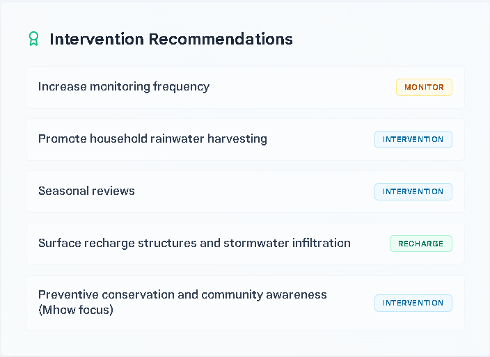

# AquaSentinel Indore - Dashboard Presentation Guide

This guide walks you step-by-step through presenting the AquaSentinel Indore dashboard. It is structured to follow the natural visual flow of the page, explaining what each element represents, how it functions, and how they all connect.

---

## 🎙️ 1. Opening & Hook (The "Why")

> *"Good morning/afternoon everyone. Today, I am excited to present **AquaSentinel Indore**, a Crisis Early Warning System designed for the Indore Municipal Corporation. As urbanization expands, managing groundwater sustainability is one of our most critical challenges. AquaSentinel is a real-time monitoring and predictive forecasting dashboard that brings visibility to our underground aquifer networks, enabling data-driven policies before water scarcity turns into a crisis."*

---

## 🖥️ 2. Live Telemetry Feed (Virtual Sensor Mode)
*(Focus on the top-left section of the dashboard)*

*   **What it is**: A live dashboard representing incoming data from sensors placed in the field.
*   **The visual elements**: Four key metric cards: **Water Level**, **pH**, **TDS (Total Dissolved Solids)**, and **Risk**. Below them is a dark, terminal-style **Sensor Control Room Console** scrolling live logs.
*   **Script to say**:
    > *"Let’s start with the heart of our live monitoring: the **Live Telemetry Feed**. In this virtual sensor mode, we monitor four vital signs of our regional aquifers in real-time: water table level in feet, water pH, TDS in parts-per-million representing water purity, and a calculated safety risk level. Below, you can see the **Sensor Control Room Console**. This terminal simulates live data packets syncing every few seconds from different nodes (like Zone-A Depalpur or Central Indore), demonstrating how the system would display live hardware feeds."*

---

## 🗺️ 3. Interactive GIS Map (Ward Risk Heatmap)
*(Focus on the map in the lower-left section)*

*   **What it is**: An interactive geographical information system (GIS) mapping out Indore's four main aquifer zones: Depalpur, Sanwer, Indore, and Mhow.
*   **The visual elements**: Saturated color-coded aquifer circles (green for Low risk, amber for Medium risk, rose/red for High risk) overlaying a high-contrast base map with English labels.
*   **Script to say**:
    > *"Moving down, we have the **Ward Risk Heatmap**. This is a real-time, interactive GIS overlay of Indore's primary aquifer blocks. Each circle represents an aquifer zone. The colors represent their current risk level: green is healthy, amber is moderate stress, and rose-red signals a high-risk zone. The map is fully interactive—clicking on any circle (for example, Mhow or Indore) instantly updates and synchronizes our entire workspace on the right to focus on that specific aquifer’s coordinates and characteristics."*

---

## 📊 4. Groundwater Forecast Analysis & Community Outlook
*(Focus on the right section of the dashboard)*

*   **What it is**: The circular stress score gauge, the human-centric community metrics panel, and the 3-column projection KPI grid.
*   **Script to say**:
    > *"Now let’s look at our **Groundwater Forecast Analysis** on the right. 
    > 
    > The first KPI card is the **Aquifer Stress Score**. This 100-point index is calculated dynamically by our backend machine learning models. It combines the current water table depth, seasonal drawdowns, and local stress factors to give engineers a single, readable score.
    > 
    > Next to the stress gauge is our **Community Water Security Outlook**. We created this card to translate abstract water measurements into human terms:
    > 1. **Population Dependent**: Shows the exact number of residents who rely on this specific aquifer (from 185,000 in Sanwer to 1.45 million in Central Indore).
    > 2. **Aquifer Runway Outlook**: Tells us exactly how many years of water supply are left in the aquifer before it reaches critical depletion under current pumping behaviors (highlighting a Stressed or Critical badge status).
    > 3. **Groundwater Health Index**: A 0-to-100 rating of the aquifer's sustainability, factoring in water quality (pH, TDS) and volume.
    > 
    > At the bottom of this panel, we have a 3-column comparative view:
    > *   **Original ML**: The baseline projected water table depth for this season.
    > *   **Simulated**: The live calculated depth factoring in any policies currently selected in our simulator. It dynamically calculates the difference and shows green or red changes.
    > *   **Model Status**: A real-time pulsing indicator confirming that the forecasting engine is fully active."*

---

## 🎛️ 6. "What If" Policy Simulator
*(Focus on the lower-right simulator section)*

*   **What it is**: An interactive sandbox where users can simulate the effects of positive water-saving policies or negative environmental/urban stress events.
*   **The visual elements**: Five accordion options with chevrons (`▶` / `▼`) and checkboxes.
*   **Script to say**:
    > *"One of the judges' favorite tools is our **'What If' Policy Simulator**. It allows municipal planners to test different policy initiatives and immediately see their environmental impacts:
    > *   Clicking on any policy reveals a detailed, simple-language explanation of how it works in the real world.
    > *   We have **three positive policies**: implementing gravel-filled *Recharge Pits* to catch monsoon rain, placing a *15% Pumping Limit* on wells, or mandating *Rainwater Harvesting* on house roofs. Toggling these immediately increases our Sustainability Runway (e.g. adding 4.5 years of supply) and lowers aquifer stress.
    > *   Conversely, we can simulate **two negative stress tests**: *Unregulated Industrial Over-Extraction* and *Concrete Urban Expansion* (which prevents rain from soaking into soil). Checking these causes the water table to sink, cutting down the years of water runway left and raising the aquifer stress score."*

---

## 📋 7. Dynamic Recommendations & Interventions
*(Focus on the bottom-right recommendations panel)*

*   **What it is**: System-generated advice cards tailored to the current block's risk profile.
*   **Script to say**:
    > *"Finally, based on the forecasted risk level and policy simulations, the dashboard automatically outputs tailored **Intervention Recommendations**. If the risk is high or critical, the engine generates urgent directives:
    > *   **RECHARGE** recommendations: e.g., 'Construct recharge pits in high-risk wards'.
    > *   **DEMAND** interventions: e.g., 'Reduce groundwater extraction by 10%' to slow depletion.
    > *   **MONITOR** directives: e.g., 'Increase monitoring frequency' to secure telemetry.
    > This gives decision-makers and municipal engineers clear, categorized, and actionable next steps at a glance."*

---

## 🏁 8. Conclusion (The "Wrap Up")

> *"In conclusion, AquaSentinel Indore doesn't just display historical charts. It active-models incoming telemetry, connects scientific projections to real community impacts, and simulates forward-looking policy options in real-time. It is a complete, scalable decision support system for modern urban water management. Thank you, and I am open to any questions."*
